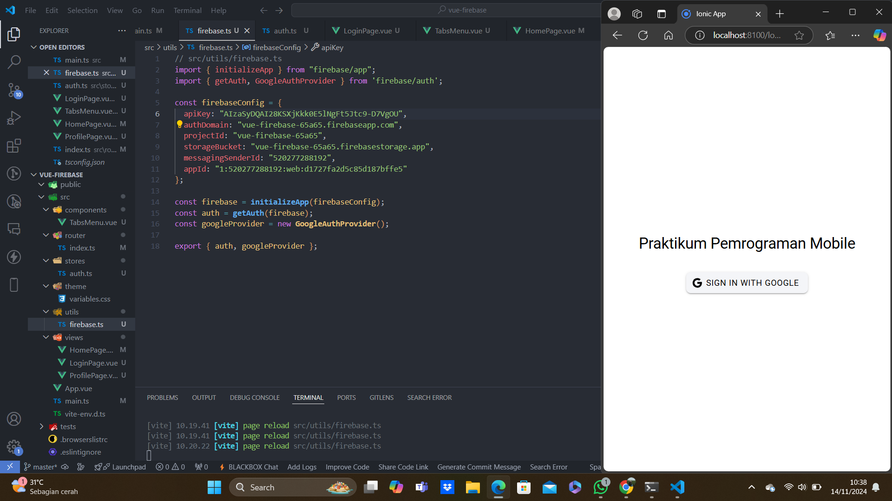
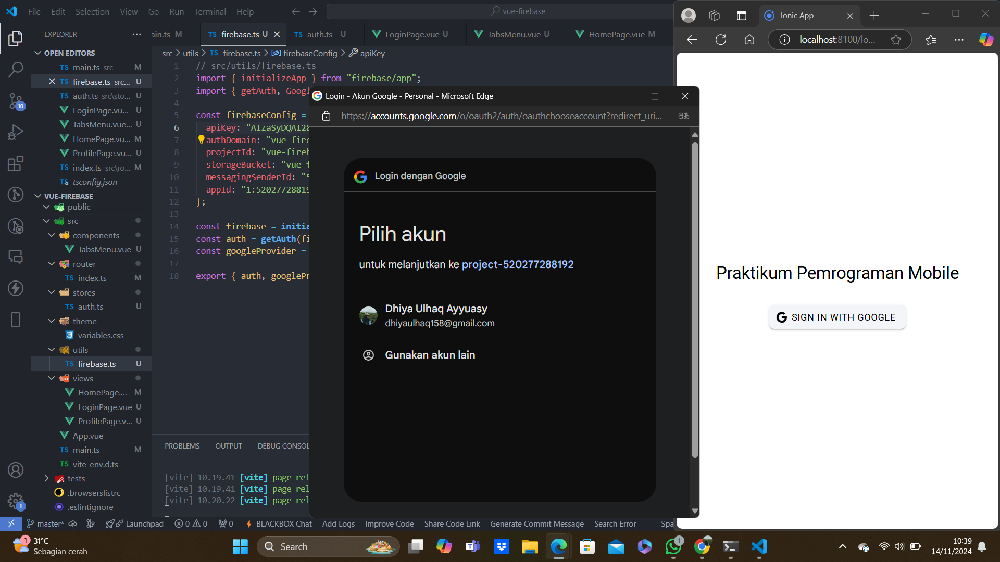
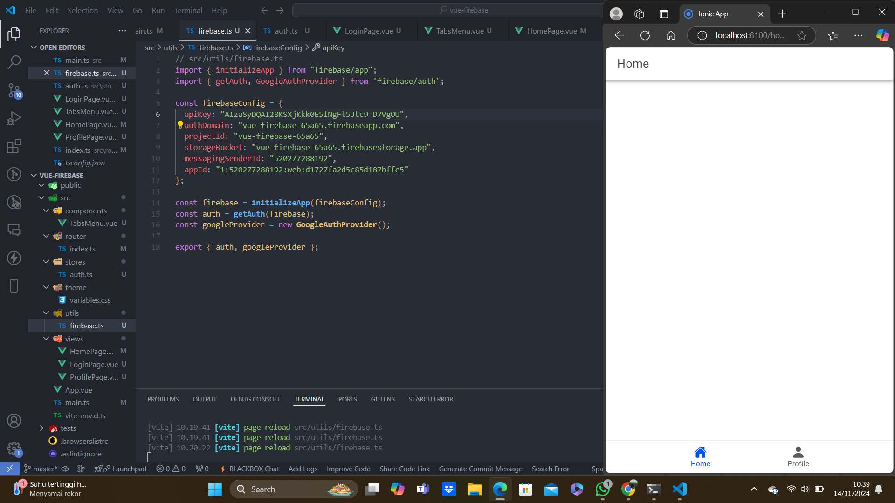
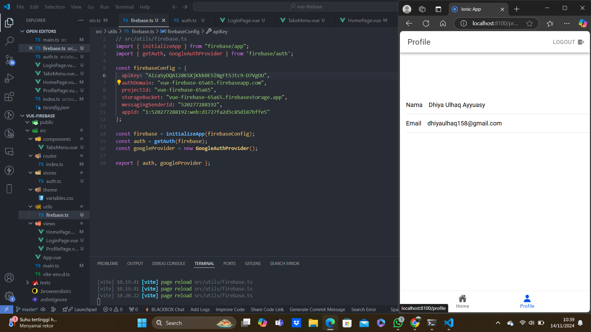

Nama: Dhiya Ulhaq Ayyuasy
NIM: H1D021040

Praktikum Pemrograman Mobile
Vue-Firebase 

Langkah-Langkah Proses Login
1. Inisialisasi GoogleAuth:
Plugin Capacitor GoogleAuth diinisialisasi dengan parameter seperti clientId, scopes, dan grantOfflineAccess.

2. Google Sign-In:
Menggunakan GoogleAuth.signIn() untuk meminta pengguna login melalui Google.

3. Ambil ID Token:
Token yang diterima dari Google digunakan untuk mengautentikasi pengguna di Firebase.

4. Firebase Credential:
GoogleAuthProvider.credential digunakan untuk membuat credential Firebase dari ID Token.

5. Autentikasi Firebase:
signInWithCredential mengautentikasi pengguna dengan Firebase menggunakan credential Google.

6. Simpan Data Pengguna:
Data pengguna yang berhasil login disimpan ke state user.

7. Navigasi ke Home:
Setelah login berhasil, pengguna diarahkan ke halaman /home.

Halaman profie terdapat:
Menampilkan data pengguna (nama, email, dan foto profil).
Menyediakan tombol logout yang menghapus sesi autentikasi.
Menampilkan menu tab navigasi melalui komponen tambahan.

Proses logout:
1. Sign Out Firebase: Keluar dari Firebase Authentication.
2. Sign Out GoogleAuth: Keluar dari sesi GoogleAuth.
3. Reset State: Set user menjadi null.
4. Navigasi ke Login: Setelah logout, pengguna diarahkan ke halaman /login.
