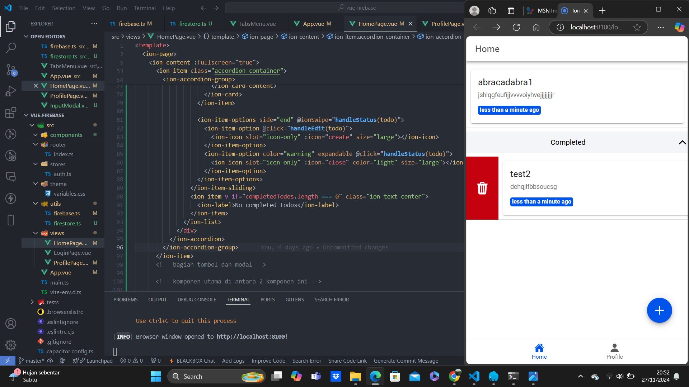

Nama: Dhiya Ulhaq Ayyuasy
NIM: H1D021040

Praktikum Pemrograman Mobile
Vue-Firebase CRUD Ionic

CRUD

Halaman Home akan tampil setelah pengguna berhasil melakukan login 
Halaman home menampilkan todo list dan task yang complete. Karena belum ada task yang ditambahkan maka halaman menampilkan no active todos dan belm ada task yang complete

Halaman add akan menampillkan form sederhana yang mengharuskan user menginputkan tittle dan description
jika sudah mengisi maka bisa melakukan klik pada button add todo
jika berhasil maka akan tampil pada todo list dan muncul alert Todo added successfully

Halaman edit akan menampillkan form sederhana yang mengharuskan user mengedit tittle dan description jika pada todolist diswipe ke kanan dan melekukan klik pada icon edit
jika sudah mengisi maka bisa melakukan klik pada button edit todo
jika berhasil maka akan tampil pada todo list  dan muncul alert Todo Update successfully

Pada saat menampilkan halaman todo list diswipe ke kanan maka akan muncul button untuk menghapus
Klik button hapus 
jika berhasil maka akan menampilkan alert Todo Delete successfully

Pada saat menampilkan halaman todo list diswipe ke kiri maka akan muncul button untuk menceklis jika task sudah selesai
Klik button ceklis 
jika berhasil maka akan menampilkan alert Todo mark as completed

